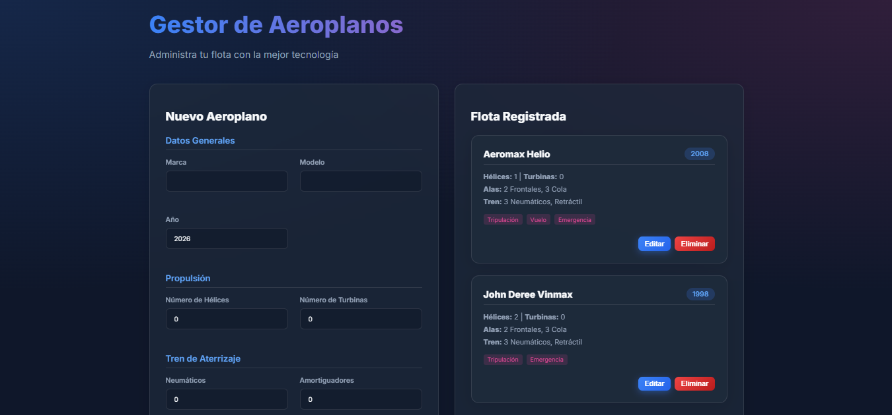
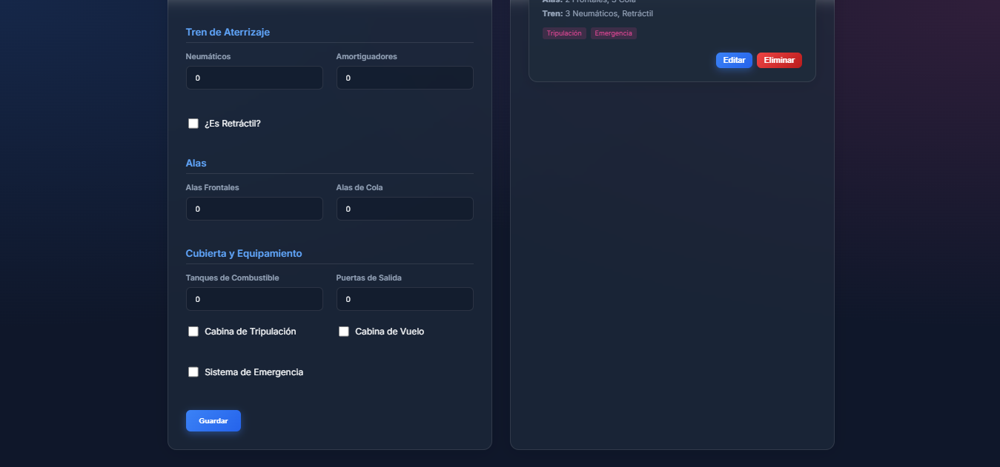
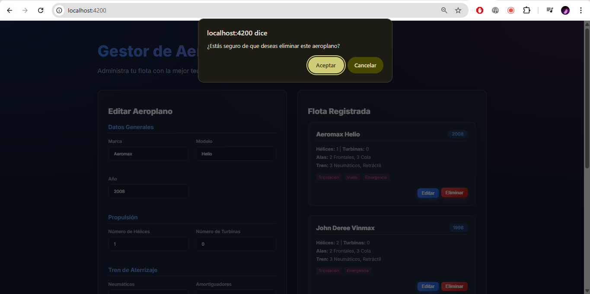

# Proyecto CRUD - Gestor de Aeroplanos ✈️

Este repositorio es una aplicación **Full Stack** (Frontend + Backend) diseñada para administrar una flota de aeroplanos. El proyecto demuestra fuertemente conceptos de **Programación Orientada a Objetos (POO)**, en donde un "Aeroplano" es una clase compuesta por múltiples partes y subsistemas complejos (Hélices, Turbinas, Tren de Aterrizaje, Alas y Cubierta).

## 🛠 Tecnologías Utilizadas

- **Frontend**: Angular (TypeScript, Standalone Components, Diseño Moderno UI/UX con Glassmorphism).
- **Backend**: Node.js + Express (TypeScript, RESTful API).
- **Infraestructura**: Docker & Docker Compose para contenerización.

## ✨ Características Implementadas

1. **Modelo de Dominio (POO)**: Implementación estricta de relaciones de **Agregación** y **Composición**. Se demuestra la Agregación inyectando componentes externos (Tren de Aterrizaje, Cubierta, Turbina), y la Composición instanciando partes directamente ligadas al ciclo de vida del Aeroplano (Hélices, Alas).
2. **REST API Completa**: Endpoints implementados en Express (`GET`, `POST`, `PUT`, `DELETE`) operando sobre una base de datos en memoria.
3. **Interfaz Premium (UI/UX)**: Interfaz diseñada desde cero utilizando CSS puro, implementando:
   - Modo oscuro (Dark Mode).
   - Estilos "Glassmorphism" (Efectos de vidrio esmerilado).
   - Diseño completamente responsivo.
   - Animaciones y transiciones dinámicas.
4. **Formulario Reactivo**: Formularios anidados en Angular capaces de construir la estructura compleja del Aeroplano para enviarla transparente al Backend.







## 🚀 ¿Cómo arrancar el proyecto?

La manera más fácil y rápida de correr toda la aplicación (tanto el cliente como el servidor) es utilizando **Docker**.

### Opción 1: Usando Docker (Recomendado)

Asegúrate de tener [Docker Desktop](https://www.docker.com/products/docker-desktop/) instalado y en ejecución.

1. Abre una terminal en la raíz del proyecto.
2. Ejecuta el siguiente comando para construir y levantar los contenedores:
   ```bash
   docker-compose up --build
   ```
3. Una vez finalizado el proceso:
   - Accede a la aplicación Web (Frontend): **http://localhost:4200**
   - El servidor API (Backend) estará escuchando en: **http://localhost:3000**

Para apagar la aplicación, presiona `Ctrl + C` en la terminal o ejecuta `docker-compose down`.

### Opción 2: Ejecución Manual (Sin Docker)

Si prefieres levantar los servidores de manera local mediante Node:

**1) Levantar el Backend**
Abre una terminal y ejecuta:
```bash
cd backend
npm install
npm run dev
```
*(El backend quedará escuchando en `http://localhost:3000`)*

**2) Levantar el Frontend (Angular)**
Abre otra terminal diferente y ejecuta:
```bash
cd frontend
npm install
npm start
```
*(El frontend quedará disponible en `http://localhost:4200`)*

## 💡 Flujo de Uso

1. Ingresa a `http://localhost:4200`.
2. Podrás visualizar el formulario para **Crear un Nuevo Aeroplano**. Llena los datos generales, características de propulsión, tren de aterrizaje, alas y equipamiento.
3. Haz clic en **Guardar**. Verás cómo automáticamente la tarjeta del aeroplano se lista en la sección de "Flota Registrada".
4. Usa los botones **Editar** y **Eliminar** en la tarjeta para actualizar los datos (se cargarán nuevamente al formulario) o para remover el aeroplano definitivamente.
